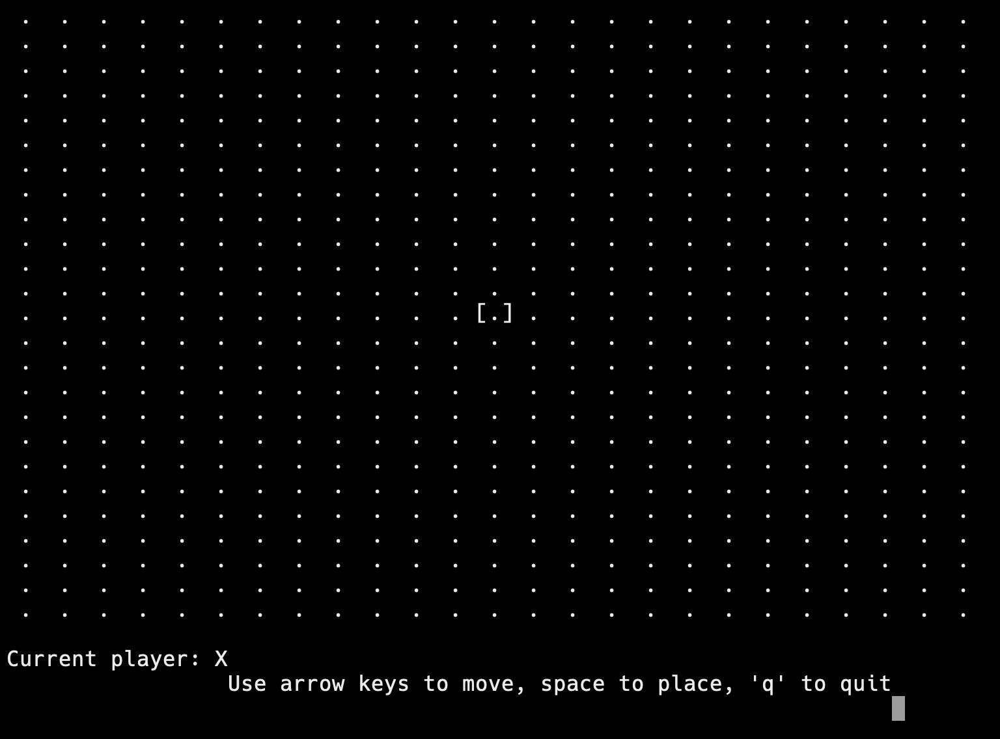
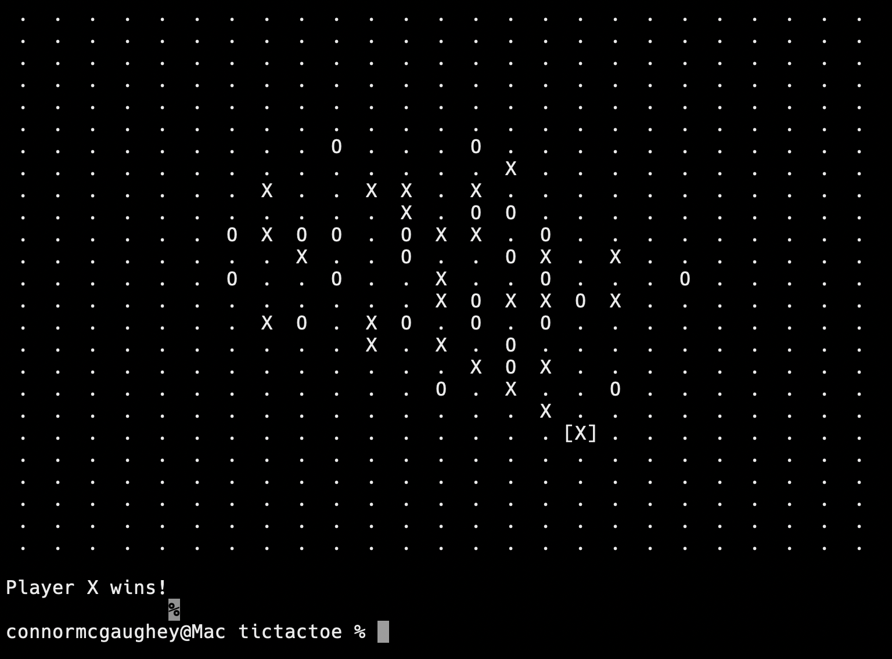

# Gomoku Console Game

A C++ terminal-based five-in-a-row (Gomoku) game.

## Features

- 25x25 game board
- Keyboard navigation with arrow keys
- Place markers (X/O) interactively
- Win detection (five in a row)
- Clean terminal graphics

## Controls

- Arrow keys: Move cursor
- Space: Place marker
- 'q': Quit

## How to Build

```bash
g++ -o gomoku game.cpp
./gomoku
```

## Screenshots

**Initial Game Board:**



**Played Example Game:**



## About

Created by Connor McGaughey (https://github.com/gaughey2000).  
Portfolio project demonstrating terminal UI, C++ raw input handling, and game logic.
